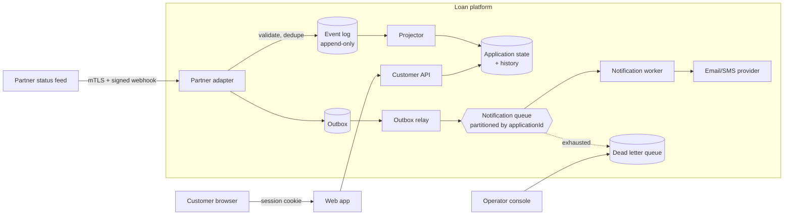

# Production design

How I would evolve this exercise into a system I would be willing to operate. The exercise code is
the starting point; this note is about what changes when the partner is real, the data is real, and
someone is paged at 03:00.

## Target architecture

## Service and data boundaries

Three services, split by trust and failure domain rather than by entity:

1. **Partner adapter** (internal, partner-facing). Terminates partner trust: authenticates the
   caller, validates the payload, assigns an ingestion id, and appends to the event log. Knows about
   partner quirks — clock skew, retry behaviour, payload dialects — so that mess never reaches the
   core.
2. **Loan core** (internal). Owns the application state machine, history, and the outbox. The only
   writer to application state.
3. **Customer API** (public). Read-mostly, owns the session/authorization boundary and the customer
   view model.

The notification worker is a consumer, not an owner of state.

**Data boundary:** the event log is the source of truth; application state and history are
projections that can be rebuilt from it. Today `LoanApplication.status` *is* the truth, so a bad
write is unrecoverable. Deriving it means a bug can be fixed by correcting the projector and
replaying — the property that matters most for a system that must produce evidence later.

Notification jobs move out of the application database into a real queue, behind an outbox so
enqueueing stays transactional with the state change (see below).

## Idempotency

Three independent layers, because each protects a different failure:

| Layer | Key | Protects against |
| --- | --- | --- |
| Adapter → event log | `(partnerId, eventId)` unique | Partner retries |
| Core → state | `(applicationId, sourceEventId)` unique | Replay, concurrent delivery |
| Worker → provider | `idempotencyKey` on the provider call | Crash after the provider accepted but before local commit |

**Implemented here:** the second layer fully, the third only as a demonstration. The unique
constraint is the guarantee; the in-code lookup is only a fast path, and a `P2002` violation is
treated as "duplicate" rather than an error. That ordering matters — a check-then-write without the
constraint is a race, and a constraint without the check makes the common path throw.

The third layer is why the provider call carries a key: a process can die between the provider
accepting the request and the local `processedAt` commit. Without the key that window sends a second
email; with it, redelivery *can* be suppressed.

**Being precise about the third layer:** `MockEmailProvider` records keys in an in-memory `Set`
scoped to a single process. I verified that two provider instances — standing in for two worker
processes — both send. It demonstrates the shape of the contract; it does not implement it. Real
deduplication has to live server-side at the provider, so this layer is only as strong as the
provider's own guarantee.

**The delivery guarantee this system actually offers is at-least-once, not exactly-once.** Ingestion
of partner events *is* effectively exactly-once, because the database enforces it. Outbound email is
not, and no amount of local locking can make it so when the final hop is a third party that may
accept a request and fail to tell us.

## Event ordering

Partners deliver out of order, so "latest received" must never mean "current".

**Implemented here:** a per-application high-water mark (`lastEventOccurredAt`) that only moves
forward. An event at or before the mark is rejected as `stale` and writes nothing. Combined with the
state machine, a late event cannot rewind a `DISBURSED` loan.

**Production:** partner timestamps are not trustworthy enough to be the only ordering signal —
clocks skew and events can share a timestamp. I would ask the partner for a monotonic per-application
sequence number and order on `(sequence, occurredAt)`, keeping `occurredAt` as a tiebreak. Where a
sequence is unavailable, partition the queue by `applicationId` so a single consumer sees one
application's events in arrival order, and treat ordering as best-effort with the state machine as
the real guard.

Ties are treated as stale: a true replay is caught by the idempotency layer, so an equal timestamp
with a different event id is a genuine ambiguity that should not silently overwrite state.

## Retries and dead-letter handling

**Implemented here:** `processedAt` is set only on success. Failures record `attemptCount` and
`lastError` and schedule `nextAttemptAt` with exponential backoff (1s → 60s cap). After
`MAX_ATTEMPTS` (5) the job is dead-lettered: excluded from polling, retained with its full failure
context. Failures are isolated per job, so one poison message cannot abort the batch or kill the
worker.

**Production:**

- **Lease-based claiming, and its limits.** A job is claimable only when unclaimed or when its claim
  is older than `CLAIM_LEASE_MS` (30s). This prevents a second worker taking a job that is actively
  being delivered, and — because the lease expires rather than locking — a worker that dies holding
  a claim strands the job for at most one lease period. There is no reaper process; expiry alone is
  the recovery mechanism. What it does *not* prevent: a delivery slower than the lease can still be
  reclaimed and sent twice. Production would renew the lease with a heartbeat for long deliveries,
  and set the duration from the observed p99 delivery time rather than a guess.
- Add **jitter** to backoff. Fixed exponential backoff synchronises retries across workers and
  produces a thundering herd against a recovering provider.
- Distinguish **retryable** from **terminal** failures. A 5xx or timeout deserves five attempts; a
  malformed address or hard bounce should dead-letter on the first attempt rather than burn five.
- **Alert on DLQ depth and age**, not just size. A DLQ nobody watches is a silent outage — which is
  exactly the failure mode of the original code.
- Give operators a **replay endpoint** that resets the job through the normal path. Today replay is
  a manual database update, which is the honest current state.
- Add a **circuit breaker**: when a provider is failing broadly, stop hammering it and shed to the
  DLQ deliberately.

## Authorization and sensitive data

**Implemented here:** ownership is enforced in the query, so another customer's row is never loaded.
"Not yours" and "does not exist" return byte-identical 404s, so responses cannot be used to probe
which applications exist. `reason` is partner-supplied free text and is no longer written to logs.

**Production:**

- Replace `x-customer-id` with a signed session or OIDC token; the customer id must come from a
  verified claim, never a caller-supplied header. The header stand-in is *only* acceptable because
  `docs/DOMAIN.md` defines it as one.
- Authorize the partner adapter with mTLS plus a signed webhook body (HMAC over the raw payload with
  a timestamp, to prevent replay). It is an internal trust boundary, not a public endpoint.
- Field-level encryption for contact details at rest; TLS everywhere in transit.
- **Done:** the partner-facing POST no longer returns contact details. It responds with
  `{ id, status }` only. The partner supplied the event and has no need for the applicant's name,
  email, or phone, and the endpoint is unauthenticated.
- **Done:** unexpected failures return `{ error: "internal server error", requestId }` instead of
  the raw message, which previously disclosed database hosts and ports. The detail is logged
  server-side against the same request id. Fastify's 4xx responses still describe the caller's own
  request, because a handler that hides those would be a worse bug than the leak.
- Structured logging with an explicit allowlist of loggable fields, so PII cannot leak by someone
  logging a whole object. Redact at the logger, not at each call site.
- Retention and deletion policy for history and notification payloads, aligned to the jurisdiction —
  and a documented answer for "delete my data" that does not destroy audit evidence.

## Auditability and evidence

History is customer-visible and may become operational evidence, so it must be defensible.

- **Append-only.** No updates or deletes on history; corrections are compensating entries. Enforced
  with database permissions, not convention.
- Record **both** `occurredAt` (partner time) and `recordedAt` (our time). Already in the schema and
  preserved; the distinction is what lets you reconstruct "what did we know, when".
- Retain the **raw partner payload** and its signature alongside the derived event, so a disputed
  status can be traced to exactly what the partner sent.
- Log rejected events too. Today a stale or invalid-transition event returns 409 and writes nothing,
  so there is no record it arrived — acceptable for the exercise, wrong for evidence. In production
  every delivery appends to the event log; only the *projection* rejects it.
- Separate the audit trail from the application database so a compromise of the app cannot rewrite
  its own history.

## Observability and incident diagnosis

- **Correlation:** propagate a trace id from the adapter through the core, outbox, queue, and worker
  so one partner delivery is one trace. Include `eventId` and `applicationId` as span attributes.
- **RED metrics** per endpoint and consumer: rate, errors, duration. Split the event endpoint by
  outcome — `accepted`, `duplicate`, `stale`, `invalid_transition` — because a spike in `duplicate`
  means partner retry storms while a spike in `stale` means an ordering or clock problem. Those need
  different responses, and the original single 202 made them indistinguishable.
- **Queue health:** oldest unprocessed job age, DLQ depth, attempt-count distribution. Age matters
  more than depth: a small queue that is not draining is worse than a large one that is.
- **Alerts** on DLQ growth, notification age p99, and any invariant violation (an application whose
  status disagrees with its newest history entry).
- **Diagnosis path:** given an `applicationId`, an operator should be able to pull every event, every
  projection decision with its reason, and every notification attempt with its provider response, in
  one query.

## Deployment, migration, rollback, backward compatibility

**Deployment.** Roll services independently behind health checks; canary the adapter and the worker
first, since they carry the reliability risk. Workers must be safe to run in multiple copies — which
is why job claiming exists here — so rolling restarts do not double-send.

**Migrations.** This repo has none: `pnpm db:reset` runs `prisma db push --accept-data-loss`, which
is fine for an exercise and unacceptable in production. I deliberately did not invent a migration
history it never had. Production would use versioned, reviewed migrations in CI with
**expand/contract**:

1. *Expand* — add nullable columns and new indexes; deploy code that writes both old and new.
2. *Backfill* — in batches, monitored, resumable.
3. *Contract* — once the new path is proven, drop the old.

**The unique index I added is the concrete example.** Adding `@@unique([applicationId,
sourceEventId])` to a live table with existing duplicate rows **fails**. The real sequence is:
identify duplicates → decide which to keep → collapse them → build the index concurrently (Postgres
`CREATE INDEX CONCURRENTLY`, which SQLite cannot do) → only then enforce. That work is invisible in
this exercise because the seed has no duplicates, and pretending otherwise would be dishonest.

**Rollback.** Schema changes here are additive and nullable, so the previous code runs against the
new schema — the property that makes rollback safe. Never deploy a migration and the code that
requires it in the same irreversible step. For data, rollback means a compensating migration, not
restoring a backup, once customers have transacted.

**Backward compatibility.** One deliberate contract change: a duplicate delivery now returns **200**
instead of 202. This is safe for well-behaved partners (both are 2xx) but is a behavioural change,
so in production it ships behind a version negotiation: keep 202 for existing partners, return the
richer taxonomy to partners that opt in via `Accept-Version`, and migrate them deliberately. The
response body is additive — an `outcome` field was added, no field was removed.

## Response taxonomy

`docs/DOMAIN.md` requires the adapter's caller to operate safely. Implemented:

| Outcome | Status | Meaning to the partner |
| --- | --- | --- |
| Malformed input | 400 | Broken; do not retry unchanged |
| Unknown application | 404 | Wrong target; do not retry |
| Duplicate delivery | 200 | Already applied exactly once; stop retrying |
| Stale (out of order) | 409 | Understood and rejected; retrying will not help |
| Invalid transition | 409 | Understood and rejected; state machine forbids it |
| Accepted | 202 | Applied |

The distinction that matters: 2xx means "stop sending this", 409 means "I understood you and
declined", 5xx means "try again". None of that was expressible before.

## Most important tradeoffs

- **Constraint before check.** Enforcing idempotency in the database rather than only in code costs
  a migration and an exception path, but it is the only version that survives concurrency. The
  concurrency test passes because of the constraint, not the check.
- **Reject stale events rather than merge them.** Simple, predictable, and preserves the newest
  business state. The cost is that a genuinely useful late event is dropped rather than inserted
  into history. With an event log, the correct answer is to record everything and let the projection
  decide — which is why the log is the first thing I would add.
- **Ties count as stale.** Conservative: it favours not overwriting state over accepting a possibly
  newer event with an identical timestamp.
- **Dead-letter rather than retry forever.** Bounded work and a clear operator signal, at the cost
  of needing someone to actually watch the DLQ.
- **Polling instead of a queue.** Kept deliberately, because replacing it is a rewrite, not a fix.
  Polling costs latency and does not scale. Lease-based claiming makes it *safe enough* — one worker
  at a time within the lease — but not exactly-once; a real queue with visibility timeouts and a
  broker-side DLQ is the proper answer, and it is the same lease idea implemented by someone else.
- **404 for unauthorized.** Slightly worse for debugging, materially better for not leaking which
  applications exist.

## What I would postpone

- Full event sourcing. High value, but it changes the data model everywhere; do it once the
  boundaries above are stable.
- Splitting into three deployable services. The boundaries matter more than the process count; a
  well-separated modular monolith is fine until team or scaling pressure forces a split.
- Multi-channel notifications (SMS, push) and templating.
- Read replicas and caching for the customer API. It is read-mostly and would benefit, but there is
  no evidence of a performance problem yet, and caching authorization-sensitive data invites exactly
  the leak that was just fixed.
- Partner-specific dialect handling, until there is a second partner to generalise from.
