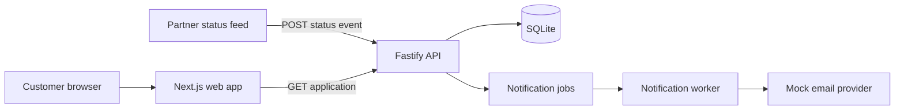

# Loan application engineering assessment

This repository is a small, deliberately imperfect loan application system. Treat it as a system you have inherited: decide what matters most, improve one coherent slice, and explain how you know your changes are safe.

The target working time is **four hours**. We value prioritization, engineering judgment, and evidence more than the number of issues fixed or lines changed. You may use any AI tools, documentation, or search tools you normally use; be ready to explain what tools and models you used, why you chose them, how you used them, and how you checked their output.

All people, applications, and contact details in this repository are synthetic.

## Scenario

A lending partner sends status events for loan applications. The API stores the current status and history, then asks a background worker to notify the customer. A customer-facing Next.js application displays the application and its history.

The system runs, but it was assembled quickly and has not had a production-readiness review. In the real integration:

- a partner may retry an event with the same `eventId`;
- events can arrive late or out of order;
- application state and history must remain trustworthy;
- notification delivery can fail temporarily; and
- one customer must never be able to read another customer's application.

You are not expected to fix everything. Read [docs/DOMAIN.md](docs/DOMAIN.md), inspect the implementation and tests, and choose a useful vertical slice.

## System map



The repository is intentionally small:

```text
apps/
  api/       HTTP routes and application update service
  web/       Customer-facing Next.js page
  worker/    Notification job consumer and mock provider
packages/
  contracts/ Shared request schemas and application states
  database/  Prisma model, client, and synthetic seed data
docs/
  DOMAIN.md  Business behavior and local API contract
```

## Run it locally

Prerequisites: Node.js 22 and pnpm 9.

```sh
nvm use
pnpm run setup
pnpm dev
```

`pnpm run setup` installs dependencies, generates the Prisma client, recreates the local SQLite database, and loads synthetic data. It is safe to run again. The web app starts on [http://localhost:3000](http://localhost:3000), the API on [http://localhost:3001](http://localhost:3001), and the worker runs in the same terminal group.

The home page opens the seeded application `app_home_001` as customer `cus_amina_001`.

Send a partner event from another terminal (a second run of the same command reports
`200 {"outcome":"duplicate"}` rather than applying it twice):

```sh
curl -i http://localhost:3001/v1/applications/app_home_001/status-events \
  -H 'content-type: application/json' \
  --data '{
    "eventId": "partner-event-100",
    "status": "IN_REVIEW",
    "occurredAt": "2026-08-20T10:30:00.000Z",
    "reason": "Documents received"
  }'
```

Useful commands:

```sh
pnpm test        # focused baseline tests
pnpm typecheck
pnpm lint
pnpm build
pnpm check       # all of the above
pnpm db:reset    # restore the synthetic development data
pnpm db:studio   # inspect the SQLite database
```

## Your task

1. **Assess and prioritize.** Inspect the system and write a short prioritized list of the most important risks. Explain what you chose to address within the timebox, what you deliberately left alone, and why.
2. **Make the changes.** Improve one vertical slice based on those priorities. Missing functionality, correctness, reliability, security, performance, and usability work are all valid when justified.
3. **Prove the behavior.** Add or improve focused tests for the risks you addressed, and record how you verified the result.
4. **Design the production version.** Describe how you would evolve this exercise into a production system, including boundaries, idempotency and ordering, retries and dead letters, authorization, sensitive data, auditability, observability, deployment, migrations, rollback, and the tradeoffs you would postpone.

## Deliverables

Submit a fork containing:

- your working implementation;
- `ISSUES.md` with the prioritized issues you found and the scope you chose;
- `DESIGN.md` with the proposed production design and tradeoffs;
- `PLAN.md` with known limitations and sensible next steps; and
- `TOOLING.md` with the tools and models you chose and how you used them to create your solution.

Your submission should still run with the commands above.
